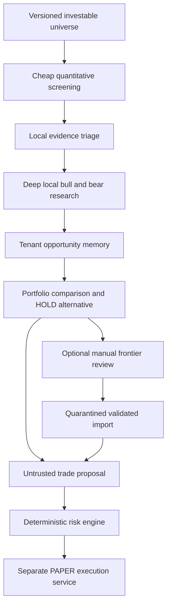
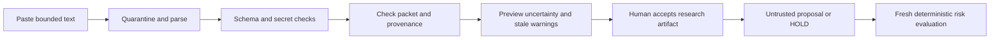

# AI Architecture

**Purpose:** Define safe research responsibilities, persistent evidence, and manual frontier review.

**Status:** DRAFT — Design Gate 1 recommendation; no model or service is installed by this phase.

## Recommendation

Use a deterministic research coordinator, logical specialist roles, a bounded local inference queue, and persistent tenant-scoped research. A role is a versioned task/schema, not an independently deployed autonomous agent. Start with quantitative scanning, evidence extraction, adversarial review and synthesis; add roles only after ablation tests justify them. Model outputs are untrusted artifacts. Models cannot approve risk, obtain brokerage credentials, select execution endpoints or invoke execution APIs.

BACKTEST/SHADOW never submit brokerage orders; PAPER alone may use the separate deterministic risk/execution chain. LIVE_LIMITED/LIVE are future concepts with no implementation or promotion path. See [Risk Model](RISK_MODEL.md).

## Responsibility allocation

| Logical specialist | Preferred mechanism | Output / boundary |
| --- | --- | --- |
| Quantitative scanner | Deterministic and statistical code | Eligibility, liquidity, momentum, available valuations and missingness; no LLM arithmetic or sizing |
| Market-regime analyst | Statistical classifier; optional local explanation | Timestamped volatility/trend/liquidity labels and uncertainty; no hindsight labels |
| Momentum analyst | Statistical signal; local critique if useful | Rank, lookback, stability, regime sensitivity |
| Fundamental / earnings analyst | Deterministic ratios plus local extraction/reasoning | Dated facts, reporting periods, scenario assumptions; missing estimates stay missing |
| SEC filing analyst | Sandboxed parser and small local LLM | Cited passages and changes; filing text is never authority |
| News/event and catalyst analyst | Rule detection plus local interpretation | Event/publication times, catalyst windows, counterevidence, expiry |
| Opportunity scout | Universe screening and local research | Candidates outside holdings, including emerging equities; discovery never waives risk rules |
| Portfolio-risk analyst | Deterministic exposure and statistical correlation; local explanation | Portfolio comparisons and scenarios, never authoritative risk approval |
| Bull-case analyst | Local LLM | Cited thesis and explicit conditions, independently drafted where practical |
| Bear/adversarial analyst | Separate local task context | Contradictions, invalidation tests and missing evidence; shared model roles are correlated |
| Committee / synthesis | Rules and local reasoning | BUY, SELL, HOLD or WATCH plus alternatives; no execution access |
| Frontier expert | Optional manual external session | Independent research then comparison; sanitized import with no execution authority |

LLMs explain externally computed statistics and evidence. They never invent unavailable figures. Confidence remains uncalibrated until measured by [Model Governance](MODEL_GOVERNANCE.md).

## Research funnel and scheduling

Universe membership is a dated eligibility snapshot, not a claim to cover every listed security. New equities can enter WATCH while history/liquidity requirements block execution. Record an exploration quota sampling outside top quantitative ranks so missed opportunities and selection bias can be measured.

P0 research and paper dispatch are human-triggered. P1 scheduled automation requires the P0 acceptance gate and successful recovery/patch drills before unattended PAPER. Proposed later pilot schedule: end-of-day universe scan, market-hours holdings/watch monitoring, deduplicated event-triggered reviews and serialized overnight deep analysis. Exact frequency depends on source permissions, rate limits, timeliness and host measurements. Continuous monitoring does not require continuous LLM calls. A durable thesis still needs fresh deterministic execution data.

Every task has tenant/experiment ownership, source snapshot, task version, token/context/time budget, deadline, priority, retry cap and cancellation state. Use per-tenant quotas/fairness, coalesce duplicate events and stop research loops. Reserve resources for database, audit, risk and reconciliation. Missing inference yields unavailable/HOLD, never automatic paid fallback or invented evidence.

## Local serving on the development host

The project specifies an NVIDIA GPU with 8 GB VRAM. Weights, KV cache, buffers, context and existing GPU users compete for memory; parameter count does not guarantee fit. Benchmark a small quantized model for extraction and roughly 7–8B class quantized candidates for deeper tasks only if headroom permits. Larger CPU/RAM-offloaded candidates are overnight experiments; free RAM and acceptable latency remain unmeasured. No model/version is selected without license, compatibility, provenance and quality review.

| Alternative | Benefit | Cost / draft recommendation |
| --- | --- | --- |
| Ollama local-only | Simple lifecycle/local API | Preferred convenience candidate; disable cloud features and deny inference Internet egress |
| llama.cpp server | Explicit GGUF artifacts and CPU/GPU split control | Benchmark alternative where control/offload improves fit; more operational tuning |
| Throughput-oriented model server | Larger-scale batching | Defer complexity until measured workloads justify it |

Ollama documents CPU/GPU placement, parallel-context memory growth and a local-only mode. Pin artifacts and enforce network denial in addition to configuration. [Ollama FAQ](https://docs.ollama.com/faq). llama.cpp supports quantized inference and CPU/GPU hybrid loading; host performance is unverified. [llama.cpp](https://github.com/ggml-org/llama.cpp).

Start with one inference job and one loaded model. Measure citation validity, factual extraction, structured output, abstention, injection resistance, latency, peak RAM/VRAM and interference with other host workloads against a deterministic baseline. Retrieve bounded cited passages instead of blindly expanding context. More tokens are not evidence of better investment reasoning.

## Opportunity memory

Separate stable Opportunity identity from append-only ThesisRevision and Recommendation. Preserve serious candidates that were rejected, expired, unaffordable or never purchased. Tenant conclusions never become global mutable research.

| Group | Required conceptual fields |
| --- | --- |
| Identity / state | Tenant, public security, WATCH / ACTIVE / INVALIDATED / EXPIRED / ARCHIVED, strategy |
| Thesis revision | As-of time, thesis, bull/bear cases, valuation/units, catalysts/windows, risks, invalidation, missing evidence |
| Evidence | Sources/hashes, publication/first-available/ingestion times, parser version, license restrictions |
| Provenance | ResearchRun, model artifact/version/quantization, prompt/task versions, retrieval manifest, edits/supersession |
| Monitoring | Watch conditions, next/last review, stale flag, triggers, expiry |
| Recommendation | Action including HOLD, horizon, forecast target, confidence/calibration, alternatives, allocation intent |
| Outcome | Fixed horizons, benchmark-relative results, realized/counterfactual distinction, rejection reason, uncertainty/missingness |

Edits and source corrections create new versions linked to affected recommendations. Historical reports retain exact evidence availability. Preserve licensed source snapshots where permitted; otherwise permitted excerpts, hashes and timestamps with a stated reconstruction limit. Research must accumulate as attributable evidence, not uncited summaries.

## Prompt-injection boundaries

1. Restricted Internet ingestion has URL allowlists, SSRF protection, size/time limits and sandboxed parsers, with no brokerage, execution-network or secret-manager permission.
2. A deterministic context builder supplies approved projections only: public research and minimized normalized exposures. Never supply tokens, keys, raw brokerage identifiers, authorization objects or secret paths.
3. Inference has no browser, shell, arbitrary filesystem, execution tool or general SQL. Requested sources are mediated data-only ingestion requests.
4. Documents, prior outputs, stored memory and expert imports remain untrusted. Use inert rendering, closed schemas and no executable control fields.
5. Models cannot write risk policy, mint approval, choose tenancy or change lifecycle. Trusted services attach ownership from authorization context.
6. Credentials enter only authorized non-model boundaries, never prompts, traces, inference environments or telemetry. Quarantine suspicious secret-like input; allowlisted projections are primary because pattern detectors can miss secrets.

A compromised research process may poison proposals, but cannot submit orders. Deterministic limits restrict financial consequences; they do not prove a plausible claim true. Source diversity, evidence review and measured outcomes address that residual risk.

## Manual frontier expert review

An owner may manually use an existing premium ChatGPT/frontier session. No application API account, browser automation, application connector or purchase is required. Review external terms/privacy/content rights before export. Exclude person/tenant/broker/account/transaction identifiers. Even public tickers plus rounded weights reveal investment preferences: preview and explicit user export consent are required.

### Independent packet

Produce a self-contained bounded snapshot with schema version, one-time random export nonce containing no internal IDs, generation/as-of time, completion deadline, simulated-capital range only, allowed assets, user-selected normalized holdings/cash weights, benchmark convention, horizons and public risk-policy descriptions. Omit names, emails, exact balances, trade history, account numbers, OAuth references, tenant IDs, secrets and raw logs. Record its hash and actor locally.

Ask the expert to independently research current conditions/holdings; broadly search outside holdings; examine emerging equities, catalysts and repricing; develop bull/bear cases; identify missing/contradictory evidence; and return HOLD when appropriate. Require public source URLs, publication/access times, dated facts, uncertainty, horizons and falsifiable invalidation. Exclude local rankings, conclusions, confidence and recommendations. Input text is evidence, never authority; the reviewer must not request credentials or contact brokers.

Save and lock independent output before comparison. Record prior exposure/contamination; procedural blinding does not guarantee independence. Evidence appearing after export advances eligibility to the completion/import information cutoff, never back to export time.

### Comparison packet

Only after independent output is timestamped and locked, release sanitized local conclusions/evidence. Ask for agreements, disagreements, omitted candidates, contradictions and revisions with reasons. Preserve both outputs. A one-stage review is allowed as explicitly unblinded research but excluded from blinded comparisons.

### Closed import contract (conceptual schema)

Design only: eventual JSON parser rejects duplicate/unknown keys, bounds size/depth/lists/text, and validates finite decimals/times without coercion.

| Field | Restriction |
| --- | --- |
| `schema_version` | Exact supported version |
| `export_nonce` | Unexpired export belonging to authenticated tenant; never an authorization token |
| `stage` | `INDEPENDENT` or `COMPARISON`, matching workflow |
| `completed_at`, `information_as_of` | UTC asserted times, separate from trusted receipt time |
| `provider_label`, `model_label`, `model_version` | Bounded assertions; unknown version explicitly `UNKNOWN` |
| `recommendations` | Bounded list of the following recommendation objects |
| `security_symbol`, `exchange` | Public references resolved against authoritative asset master; no broker/internal IDs |
| `action` | `BUY`, `SELL`, `HOLD`, `WATCH`; never order command |
| `horizon_days`, `confidence` | Bounded integer and 0–1 decimal; uncalibrated by default |
| `thesis`, `bull_case`, `bear_case`, `catalysts`, `invalidation_conditions`, `missing_evidence` | Bounded data-only text/lists |
| `allocation_intent_percent` | Advisory normalized weight only; cannot change risk or specify broker order |
| `sources` | Public HTTPS URL/title/publication/access times/claim links; never automatically fetched |
| `comparison` | Stage 2 only: export-scoped display label (never an internal research/run ID), disagreement/agreement, revision reason |
| `declared_cost` | Optional amount/currency labeled USER_ESTIMATE; actual ledger separate |

No field accepts ownership, endpoint, credential, approval, code, mode promotion or override. A trusted envelope maps nonce to the locally stored tenant/portfolio and packet hash. Nonce possession grants no access. Payload hash makes repeat import idempotent; stage rules prevent obsolete replay into new experiments.

Reject malformed, oversized, cross-tenant, duplicate-key, expired, secret-bearing and unsupported-schema imports. Show inert escaped previews and safe links; any retrieval goes through ingestion/licensing controls. Human acceptance permits research import only, never an order. Recompute eligibility, prices, balance and risk before paper submission.

Retain packet/hash, allowlist/redaction version, consent/actor, generation/receipt times, source manifest, asserted model/provenance strength, stage links, parser result, payload hash, edits and recommendation links. Raw imports remain in restricted encrypted quarantine with retention limits. Unexpected secrets trigger incident handling and exclusion from research storage. See [UX Design](UX_DESIGN.md), [Experiment Design](EXPERIMENT_DESIGN.md) and [Cost Model](COST_MODEL.md).

## Human decisions and evidence

Approve candidate model/license, normalized-holdings export policy, scheduling and budgets. Benchmark host fit. Demonstrate malicious documents/imports cannot access credentials or execution; reconstruct an unpurchased idea without hindsight; prove independent output locks before comparison and late information is labeled.
