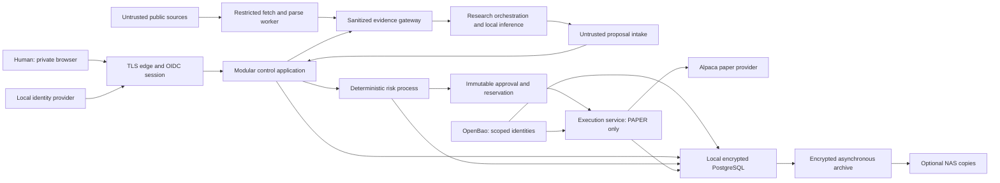

# Proposed System Architecture

**Status:** DRAFT — recommendation for Design Gate 1, not deployment authorization.
**Purpose:** Define boundaries, alternatives, integration contracts, and failure behavior.
**As of:** 2026-09-08. [AGENTS.md](../AGENTS.md) governs; implementation follows human gate approval.

## Recommendation and scope

Choose **B: a modular application with security-sensitive components in dedicated processes/services**. Product modules share a codebase and transactional database; research ingestion, local inference, deterministic risk, and brokerage execution have distinct runtime identities and privileges. Logical research specialists are versioned roles, not individually deployed microservices.

V0 is a LAN/private-access experimental system on PodFlix. PAPER is the only external trading environment. BACKTEST and SHADOW label non-executing evaluation contexts; neither can submit broker orders. LIVE_LIMITED and LIVE exist only in future design vocabulary, with no V0 route, adapter, endpoint selection, credential grant, migration, or promotion action. Human approval of Design Gate 1 alone does not authorize real-money capability.

A small simulated economic portfolio of $100–$300 sits behind a virtual capital cap even if the paper broker reports larger buying power. No single-tenant shortcuts, payments, paid inference requirement, Kubernetes, active-active database, or public registration in V0.

## Context and trust boundaries

Arrows are conceptual allowed flows, not shared-network permission. Model runtime has neither general database access nor secret-manager access. Its gateway provides allowlisted, redacted context; service authentication stays in transport outside model inputs. Research cannot resolve/reach risk administration or broker submission endpoints. Browser never receives broker tokens. Read-only broker synchronization also runs within execution because the same broker credential may authorize orders.

## Modules, processes, ownership

| Component | Owns | May read/write | Must not possess |
| --- | --- | --- | --- |
| Control application | Tenant/membership checks, portfolios, settings, opportunities, UX, reports, experiment registration | Tenant-scoped product rows; request proposal/risk work through contracts | Broker tokens, TDE principal keys, risk approval signing authority |
| Evidence gateway and fetch worker | Source retrieval, quarantine, parsing, provenance, export minimization | Public/licensed evidence; scoped sanitized tenant context | Execution permissions, arbitrary internal URL access |
| Research worker and local model server | Versioned roles, bounded prompts, schema-checked advisory output | One job's sanitized context; narrow advisory-result submission | Raw account identifiers, secrets, writable financial ledger, risk settings |
| Risk service | Versioned deterministic policy, reservations, ALLOW/REJECT/DEFER outcomes | Authorized portfolio state, independent market snapshots, risk evaluation rows | Brokerage credentials, Internet research tools |
| Execution and reconciliation service | Paper credential use, order state machine, broker sync, stop enforcement | Valid approvals, financial ledger/order rows within scoped contract | Model tools, general Internet browsing |
| Identity provider | Authentication/passkeys, recovery, sessions | Separate identity database and dedicated identity only | Broker authority or automatic tenant trade permissions |
| PostgreSQL | Authoritative transactional state, durable jobs, audit append | Separated roles/schemas, FORCE RLS on tenant tables | Unseal shares or plaintext master keys in ordinary config |
| OpenBao | Secret lifecycle, principal keys, transit/envelope key operations | Dedicated local integrated storage | Dependence on the PostgreSQL database it unlocks |
| Maintenance/backup operator | Explicit migration and recovery tasks | Short-lived maintenance grants and encrypted backup scope | Standing support access to tenant secrets |

Shared deployment artifacts are acceptable if entrypoints, mounts, capabilities, dependency sets and service credentials differ. No runtime import path is an authorization boundary. Separate repository packages prevent research dependencies entering execution images. Language/framework choice remains a small post-gate spike: Python suits quantitative work; Python versus another typed backend and TypeScript frontend are implementation choices, not reasons to weaken boundaries.

## Alternatives and draft recommendations

| Decision | Alternatives and tradeoffs | V0 recommendation / reconsider when |
| --- | --- | --- |
| Deployment | Many microservices multiply distributed failures and operations; single process shares broker and research authority | Modular core plus isolated risky processes; split product modules only with measured load/team need |
| Database | Upstream PostgreSQL plus disk encryption does not meet explicit TDE requirement; Percona adds version/tool constraints; managed TDE costs money | Qualify Percona Server for PostgreSQL with pg_tde; no sensitive deployment until full encryption/restore matrix passes |
| Jobs/events | Redis adds cache/queue durability decisions; NATS JetStream adds stream administration; database queue shares failure domain but permits atomic enqueue | PostgreSQL durable outbox and bounded leased workers; Redis/NATS deferred until measured contention/fanout |
| Identity | Application-native authentication minimizes containers but creates credential/recovery engineering; Authentik and Keycloak supply mature OIDC/passkey flows with operational cost | Propose local Keycloak, qualify passkeys/recovery and encrypted storage; Authentik remains viable if host/operator fit is better |
| Tenant storage | Database-per-tenant strengthens operational boundaries at migration/backup cost; shared tables need disciplined application and RLS enforcement | Shared tenant-keyed schema with FORCE RLS and composite constraints; separate database option through repository boundary later |
| Internal integration | Synchronous REST is inspectable but unavailable callers must handle errors; events decouple but duplicate/reorder | Typed authenticated request/response for interactive actions, durable DB events for long work; no event bus required |
| Local inference | Ollama is operationally simple; llama.cpp gives finer memory/offload control; high-throughput serving adds complexity | Local provider interface, benchmark Ollama and llama.cpp on actual 8 GB host before selecting model/runtime |
| Storage | Local SSD gives predictable critical-path IO; NAS adds network failure/latency | Local encrypted primary and spool, asynchronous NAS archives with quotas |
| OpenBao | Single local node simplest, manual unseal affects availability; colocated multi-node cannot survive host failure; external KMS incurs dependency/cost | Separate local service/integrated storage and manual unseal; independent protected recovery material |
| Broker abstraction | Generic least-common-denominator interface can hide safety differences; broker-specific code everywhere prevents portability | Capability-aware adapter inside execution; one Alpaca paper implementation after contract qualification |

Keycloak documents container operation and passkey administration; Authentik documents its server/worker architecture. These support evaluating local identity, not a claim that default deployments are secure. [Keycloak containers](https://www.keycloak.org/server/containers), [Keycloak administration](https://www.keycloak.org/docs/latest/server_admin/), [Authentik architecture](https://docs.goauthentik.io/core/architecture/).

## State, contracts and authorized workflow

A request context binds authenticated subject, verified membership, tenant, portfolio and account. Tenant identifiers from URLs, jobs or model output do not confer authority. A shared database role with an arbitrary tenant SET value is not sufficient: qualify a database-boundary verifier for scoped expiring authority or tenant-scoped role pools before storing tenant data. Control creates an immutable proposal only after schema validation and trusted account resolution; model output never chooses a connection secret path or broker endpoint.

Risk evaluates an exact proposal digest against policy version, portfolio state version, independent quote snapshot, virtual-capital budget, outstanding reservations, lifecycle, health and stop epoch. It atomically creates a reservation and one-use approval containing those bindings plus expiry and maximum quantity/value. Any change needs a new evaluation; UI approval cannot edit the old approval. Restricted database privileges prevent control/research from minting approval rows. Execution checks issuer, membership/mandate, tenant/account bindings and payload digest itself.

P0 risk previews are non-authoritative. The human requests dispatch for an exact proposal version, then risk freshly evaluates/reserves it before execution admission; a pre-click preview cannot be reused as the final five-second approval.

Before dispatch, execution serializes account admission, validates freshness, reconciled state and current stop epochs, consumes approval once, and persists the order intent plus audit/outbox atomically. Account leases/fencing protect local ownership and admission only: the broker does not enforce a database fencing epoch, and a paused old worker can resume after its lease expires. Therefore an admitted intent has at most one outbound submission attempt; another worker treats it as UNKNOWN and performs read reconciliation, never another submission on lease expiry. An unresolved prior attempt blocks subsequent account dispatch. A not-found lookup alone is insufficient to clear ambiguity; any operator recovery must establish prior worker/transport quiescence and authoritative broker outcome before new intent.

Network side effects cannot be atomic with PostgreSQL: preserve UNKNOWN outcomes and reserve exposure until reconciled. A sent request is never counted as a fill. Test a worker paused after admission and resumed after lease expiry alongside a takeover. See [RISK_MODEL.md](RISK_MODEL.md).

The database is authoritative for jobs; notifications are hints. Jobs carry schema version, tenant/actor scope, correlation ID, deadline, lease/attempt, immutable input references and deduplication key. Enqueue with business transaction; acknowledge after durable result. Retry idempotent work with bounded backoff, dead-letter malformed work, and prioritize reconciliation/stop activity above research. A queue lease expiring does not authorize resubmitting a broker order. PostgreSQL describes SKIP LOCKED as useful for queue consumers, not a consistent financial-state snapshot. [PostgreSQL locking](https://www.postgresql.org/docs/18/sql-select.html).

## Deployment and resource budget

Assume Ubuntu, Docker Compose, RTX 2070 Super 8 GB VRAM and shared PodFlix workloads as supplied by the owner; no hardware or service inventory was performed in this phase. Before deployment measure free disk, disk encryption feasibility, RAM, GPU contention, backups, driver compatibility and existing network exposure. Do not reconfigure the host's other services implicitly.

Plan distinct edge/control, research-egress, financial, and management networks with host firewall egress enforcement. Publish only TLS edge to approved private clients; bind database, OpenBao, model and admin listeners internally. Compose networks alone do not authenticate services or provide strong containment from a compromised host. GPU access belongs only to inference. Docker socket, host PID/network namespaces, privileged containers and broad host mounts are prohibited in application workloads. [Docker security model](https://docs.docker.com/engine/security/).

Reserve CPU/RAM/IO for identity, database, stop and reconciliation. One local model job initially; bound model context, document size, concurrency and queues. Large reasoning via CPU offload is overnight and preemptible. Delay research on memory/IO pressure, never starve execution bookkeeping. No latency claim or exact model fit until benchmark. Local filesystem hot evidence and audit spool must be bounded, encrypted and independently monitored.

## Outage and restart policy

| Failure | Safe behavior | Recovery evidence before PAPER dispatch |
| --- | --- | --- |
| Host reboot/crash | Durable stop defaults engaged; broker may still fill pre-crash orders | Unseal, DB recovery, intent/open-order/fill reconciliation, health and human re-arm |
| Database down/full | No new submissions or approvals; UI reports unavailable, no fabricated balances | Restore durable records and audit capacity, reconcile broker state, re-evaluate proposals |
| OpenBao sealed/unavailable | Halt new submission authorization; no insecure credential fallback; cached-key behavior is not guaranteed | Restore scoped access, check credential validity, reconcile; restart may require manual unseal |
| Broker timeout/outage | Mark unknown, keep reservation, no blind retry or failover broker | Query original client order identity and fills, settle ambiguity or human investigation |
| Model failure | HOLD/local deterministic arm continues only if independently authorized | Validate model health and approved version; expired jobs discarded |
| Data outage/staleness | Reject risk evaluations requiring missing information | Fresh source timestamps and accepted quality/coverage checks |
| Identity outage | No new sessions/re-arm/risk-limit changes; safety stop remains through operator channel | Recover IdP and revoke suspect sessions; re-authentication |
| Network partition/clock error | No fresh authorization when dependencies/clock cannot be trusted | Time synchronization and monotonic lease checks; resnapshot market/account |
| NAS down | Continue local operation; archive lag alert | Resume validated uploads without duplicate overwrite; local capacity guard |
| Audit sink unavailable | Financial audit commits locally with transaction; stop new dispatch if local durable append fails | Capacity/integrity repaired and archive backlog bounded |

Kill switch atomically advances a durable global/tenant/account/portfolio stop epoch and blocks admissions ordered after that commit. A dispatch admitted before the stop may reach the broker or fill afterward; cancellation is best-effort and is never automatic liquidation. During DB failure an independent operator mechanism can disable the execution process/network, but cannot retract broker-side orders. UX must show residual open exposure until reconciled.

Recovery and operational proposals are in [OPERATIONS_PLAN.md](OPERATIONS_PLAN.md); cross-component security and key lifecycle in [SECURITY_ARCHITECTURE.md](SECURITY_ARCHITECTURE.md).

## Portability and exit criteria

Keep market data, broker, model serving, secret-manager operations, blob archive, identity and job dispatch behind explicit capability/version contracts. Do not build speculative cloud adapters. Tenant-scoped ownership survives a future database split; exported schemas and append-only financial events permit independent reconciliation.

Design Gate 1 reviews this recommendation and its [draft ADRs](ADR/README.md). Implementation must first prove TDE and restoration, tenant authorization boundaries, PAPER-only adapter behavior, idempotency and stop races with a broker simulator. Public SaaS, live capability, pricing and high availability have separate human/legal/security gates.
