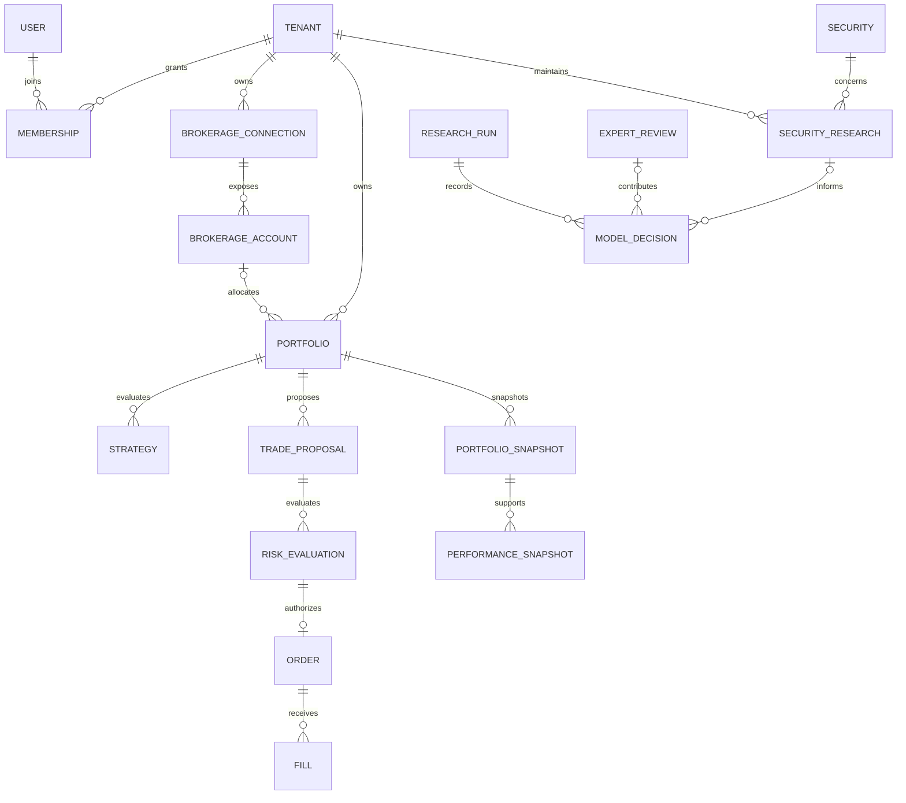

# Data Architecture

**Purpose:** Define conceptual entities, ownership, financial integrity, information provenance and lifecycle before physical schema implementation.

**Status:** DRAFT — no migrations, database services or production records are created in Phase 2.

## Principles

Every tenant-owned record has immutable tenant ownership. Accounts/portfolios carry their own lifecycle, currency, policy and history. No global current user, strategy, account, portfolio or cash balance exists. Global/platform emergency stop is deliberately global and distinct from tenant, account and portfolio stops. Public reference data has separate governance from private tenant research.

PostgreSQL is the transactional system of record with mandatory TDE and verified local encrypted storage described in [security architecture](SECURITY_ARCHITECTURE.md). Large bounded artifacts use local encrypted storage plus database manifests, digests and tenant access controls; paths do not establish permission. PostgreSQL jobs suffice initially; no separate vector database/warehouse is required. NAS stores optional asynchronous encrypted archives, never primary financial state.

## Main relationships

The diagram shows principal relationships, not the full schema. BACKTEST/SHADOW portfolios need no BrokerageAccount. A portfolio has at most one broker account at a time; allocation changes are versioned. The conceptual model permits multiple historical portfolios per account; concurrent future allocations require an explicit allocation ledger and shared account-level reservations. Accounts cannot belong to multiple tenants. The proposed V0 invariant permits at most one active PAPER portfolio per account, enforced by constraints, while allowing many tenant/account/portfolio records and preserving history. A model decision may concern a regime instead of one security and may originate locally without an ExpertReview.

## Conceptual entity catalogue

| Entity | Essential relationships/data | Integrity obligation |
| --- | --- | --- |
| Tenant | Immutable ID, display label, status, policies | Suspension blocks work; deletion is controlled |
| User | Internal ID, IdP subject, minimal profile | Stable mapping; identity alone grants no brokerage access |
| Membership | Tenant/user, roles, validity, version | Unique current membership; revocation affects queued authority |
| ServicePrincipal | Identity, issuer/capability references | No key material; scoped delegation/rotation history |
| BrokerageConnection | Tenant/provider, secret reference, consent/scope, mode attestation | Execution-only secrets; encrypt sensitive metadata |
| BrokerageAccount | Tenant/connection, encrypted provider ID, currency, verified mode/status | Opaque internal identity never exposed to models |
| Portfolio | Tenant, optional account, lifecycle, currency, allocation policy | Immutable lifecycle history; no live activation implementation |
| Strategy | Tenant/portfolio, version, experiment arm, enabled state | Versioned changes; cannot own broker secrets |
| RiskProfile | Tenant/scope, limits, version, actor, effective time | Models cannot weaken hard limits |
| Security | Stable instrument ID, symbol history, exchange/type, corporate actions | Ticker is not a stable primary identity |
| MarketObservation | Security, provider/feed, event/receipt/availability time, value/quality | Append corrections; preserve point-in-time version |
| SourceArtifact | URI, publisher/date, acquisition/availability, digest, license/version, storage reference | No credential URLs; quarantine/retention controls |
| ResearchRun | Tenant, purpose, universe/cutoff, agent/model/prompt, budget, completion state | Snapshot allowed inputs; preserve failed/skipped runs |
| SecurityResearch / OpportunityMemory | Tenant/security, thesis versions, bull/bear, catalysts, invalidations/watch conditions, sources/status | Keep unpurchased/rejected candidates and later outcomes |
| ModelDecision | Tenant/run, structured output, confidence definition/horizon, sources/provenance, validation | Immutable original; revisions link prior decision and cutoff |
| RecommendationOutcome | Recommendation, predeclared horizon/rules, observed outcome/version, missing reason | Include rejected/expired/HOLD; never rewrite forecasts |
| TradeProposal | Tenant/portfolio, instrument/action, quantity/notional bounds, rationale/expiry, originating decisions | Data without authority; modifications create new versions |
| RiskEvaluation | Proposal version/hash, account/policy/market snapshots, rule results, reservation, expiry/permit | Risk-only writes; allow/reject/indeterminate all preserved |
| OrderIntent / Order | Tenant/account, proposal/evaluation, immutable requested contents, broker client identity/state | Intent before send; submission is not fill |
| BrokerObservation | Order/account, source, event/receipt time, status, digest/redacted payload | Deduplicate observations; preserve corrected/out-of-order events |
| Fill | Order, provider execution identity, quantity/price/fees, event/receipt time | Idempotent ingestion; busts/corrections link original |
| CashLedger / PositionLot | Tenant/account/portfolio, source event, currency/quantity, allocation/cost basis | Immutable contributing events; no arbitrary balance edits |
| Position | Tenant/portfolio/security, quantity/cost basis, as-of/reconciliation version | Derived state with retained contributing events |
| PortfolioSnapshot | Positions/cash/reservations, valuation source/time, policy/reconciliation state | Immutable; mark incomplete/stale valuations |
| PerformanceSnapshot | Portfolio/experiment, period, benchmark/method version, gross/net/cost allocation | Recomputations create versions, not overwritten history |
| AuditEvent | Scope/actor/action/object/version, event/receipt, correlation, sequence/hash | Append-only API; external checkpoints for tamper evidence |
| ExpertReview | Tenant, packet/import versions/hashes, redaction/consent, declared provenance/cutoff | Untrusted import; no execution authority |
| CostRecord | Tenant/run/experiment, provider/unit, incurred/observed time, amount/currency, allocation method | Actual/estimated/imputed distinguished; missing is not zero |
| Job / OutboxEvent | Tenant, authenticated delegated scope, operation/version, lease/attempts, causation/idempotency | No secrets; revalidate expiry and current authority on claim |
| StopState / LifecycleEvent | Global/platform, tenant, account or portfolio scope, epoch, reason/actor, old/new state | Durable history; uncertain restore stays stopped |

## Tenant keys and referential integrity

Use a unique tenant ID/object ID pair for tenant-owned objects. Foreign keys between tenant objects include tenant ID; uniqueness of object ID alone cannot prevent a cross-tenant reference. Business unique keys reflect provider/account/client-order and provider/account/fill identities. Random IDs resist enumeration but never replace authorization.

Avoid tables mixing public/private rows. Identity/membership lookup is a restricted operation, not permission to enumerate tenants. Platform events have explicit platform scope in separately permissioned tables/views; no nullable-tenant RLS bypass. Only a reference-data identity mutates shared market/security records.

Ownership applies to APIs, jobs, queries, caches, exports, archives, cost allocations and subscriptions. Maintain a complete tenant-bearing-table/path policy catalogue. New tables/migrations require ownership/RLS tests covering cross-tenant references, missing context, pooled connections, user revocation during queued work and error normalization.

RLS defaults to denial when enabled without an applicable policy, but FORCE does not constrain superusers/BYPASSRLS. [PostgreSQL row security](https://www.postgresql.org/docs/current/ddl-rowsecurity.html) Use non-owner runtime roles, narrow grants, read/write policies and separate migration identities. Tenant authority must be independently authenticated, not just a freely set session variable; the security architecture identifies the required context/role-pool qualification. Parameterized queries remain mandatory.

Database-per-tenant narrows ordinary credentials and can simplify some destructive operations, but adds provisioning, migration, backup and resource costs. Shared schema plus validated context/RLS is proposed for V0. Neither option protects against host root or a platform principal authorized for every tenant.

## Financial and temporal integrity

Persist money, quantities and prices with decimal types and explicit currency/precision metadata; never binary floating point for authoritative balances or order rounding. Preserve provider precision and record rounding at the broker boundary. Derived analytics may use method-appropriate numerics with documented tolerances. Reject non-finite/inconsistent values.

Transactions atomically reserve account cash/exposure, persist risk authorization and append events. Execution atomically consumes an authorization and persists intent before sending. Jobs/broker observations use idempotent consumers. Database transactions cannot atomically commit a remote brokerage operation; UNKNOWN requires reconciliation, not an unconditional retry. A fill survives failure of its parent job.

Separate event time, receipt time and earliest verified information-availability time in UTC; retain source timezone and market-calendar meaning. Preserve acquisition/correction versions. Do not retrofit splits/dividends/symbol changes/delistings/restated statements into historical input snapshots. Benchmark total-return and strategy accounting share consistent corporate-action/cash-flow rules.

Evaluation can use only information available at or before the decision cutoff. Publication timestamp alone is insufficient when ingest is delayed or a source revised. Preserve universe membership/effective dates to detect survivorship bias. Clock health affects execution and experiment validity. Outcome-definition changes create prospective experiment versions.

## Classification and approved use

| Class | Examples | Protection | Model/export rule |
| --- | --- | --- | --- |
| PUBLIC | Licensed filings, public news metadata, instrument facts | Provenance/license/integrity | Approved sanitized facts/excerpts subject to usage rights |
| INTERNAL | Model/software versions, generic prompts, sanitized operational metrics | Access control; no secrets in Git | Approved technical metadata only |
| CONFIDENTIAL | Tenant research/preferences/holdings/history/performance/audit | Tenant authorization, TDE/encrypted files; selective envelope encryption | Minimized approved projection; explicit external-export consent |
| HIGHLY SENSITIVE / SECRET | PII, brokerage identifiers, OAuth/API/session tokens, application/encryption/unseal secrets | Minimize PII, encrypt sensitive fields; actual secrets in OpenBao/offline custody | Never model context, expert packets, telemetry or Git |

PII and brokerage identifiers are not necessarily cryptographic secrets but receive strongest initial handling. Research can reveal finances after names are removed. PUBLIC classification is not redistribution permission. Embeddings/summaries/prompt caches inherit source confidentiality and ownership. No shared-model training on private content by default.

Model projections remove tenant/user/account IDs, contact information, secrets and unnecessary transaction identities. Symbols and analytical holdings weights may remain when needed; external exports disclose re-identification risk to the user. Cross-referencing uses a packet-scoped label unrelated to internal IDs; the mapping remains in the control application. Import resolves labels only through the authenticated tenant's packet, not arbitrary model-supplied object IDs.

## Opportunity memory and evidence

Version research states such as WATCH, ACTIVE_RESEARCH, PROPOSED, REJECTED, HELD, INVALIDATED, EXPIRED and CLOSED separately from order states. Bull/bear claims each reference evidence, cutoff and confidence definition. Catalysts include expected timing/conditions and observed resolution. Record invalidation conditions before outcomes occur.

Preserve model/version/quantization, prompt/agent version, allowed inputs, digests/citations, structured decision and validation failures. Fresh research may supersede but cannot edit prior knowledge. Keep rejected ideas and HOLD outcomes for [experimental comparison](EXPERIMENT_DESIGN.md). Counterfactual rejected trades need explicit assumptions, not invented fills.

Retain complete source snapshots only where licensing/privacy/size policy permit. Otherwise retain permitted excerpts, retrieval metadata and hashes, and mark reconstruction limits. URLs alone are not reproducible evidence; a hash proves equality only if the original survives. Do not claim reconstructability with insufficient retained evidence. Block reliance on that source for consequential proposals or obtain an adequate permitted record.

## Retention, deletion and export

Do not invent regulatory retention durations. Maintain a register with class, purpose, owner, minimum necessary period, legal-review status, deletion mechanism, backup expiry and holds. Retain experiment evidence for preregistered study/review needs; expire irrelevant source documents and temporary projections promptly. Financial audit retention and customer rights need legal validation before commercialization.

Deletion disables work, revokes sessions/broker authority as appropriate, reconciles pending PAPER orders and evaluates justified holds. Delete/anonymize eligible personal content, embeddings/caches/artifacts; preserve only justified restricted records. Tombstones prevent backup restoration from reactivating deleted tenants. Restore reapplies deletion/revocation before services resume. Explain backup/immutable-archive limits; never promise instant erasure or crypto-erasure without exclusive-key proof.

Export requires fresh authentication, permission, explicit scope and job quotas. Deliver versioned portable manifests, schemas, owned research/portfolio/audit/cost records and permitted evidence with hashes. Exclude secrets, keys, unrelated tenants and restricted third-party content. Use short-lived single-tenant access and audit receipt/expiry. Support sees redacted diagnostics by default; content access is reasoned/time-limited/audited. Administrators/backup operators remain privileged and use separate identities.

## Storage consistency and recovery

Backup manifests record database recovery point, artifact version/checksums, schema/model versions and required key versions. Database/artifact backups must expose missing or dangling references; artifact publication and manifest update must recover consistently. OpenBao backups and recovery material remain separated from financial data and each other. No runtime data enters Git.

Restoration verifies all tenants, financial sequence/reservations/ambiguous intents, RLS, encryption, artifacts and audit checkpoints. NAS loss delays archive retrieval only; active evidence and execution data remain local. Move evidence off-host only after proving active jobs/proposals do not depend on it. Restored execution stays stopped until broker reconciliation and authorized PAPER resume.

## Data quality and physical-design gates

Define feed freshness, missing bars, conflicting prices, split adjustment, currency/calendars, duplicates and corrected-file policies per provider. Reject consequential proposals with inadequate data instead of imputing tradable prices. Stale dashboards may display explicit timestamps while execution blocks.

Before physical schema approval demonstrate compound ownership, trusted tenant context, decimal/reconciliation fixtures, point-in-time queries, event/outbox atomicity, encryption of tables/partitions, encrypted migration/rollback and database-plus-artifact restore. Defer partitioning, warehouse/vector infrastructure and time-series extensions until measured need and compatibility checks. See [test strategy](TEST_STRATEGY.md) and [specialist review](reviews/SECURITY_DATA_REVIEW.md).
