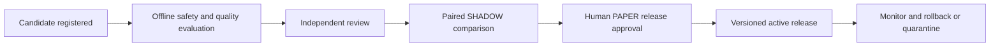

# Model Governance

**Purpose:** Control model, prompt, data and strategy changes and make research behavior testable and attributable.

**Status:** DRAFT — controls need Design Gate 1 approval and later implementation evidence.

## Principle and inventory

Models are research dependencies, never investment authorities. Approval to run a model grants no execution permission. Release in this document means release into permitted experimentation, at most PAPER. No artifact/automation promotes an account to LIVE_LIMITED/LIVE. Every discovered finance, authorization, tenancy, security or model-safety bug creates a regression test before the relevant fix is complete.

Maintain ModelArtifact, PromptTemplate, AgentTask, DatasetVersion, EvaluationRun and ModelRelease independently. A display name is insufficient provenance.

| Area | Required metadata |
| --- | --- |
| Artifact | Provider/locality, identifier/version or UNKNOWN, source/publisher, license/commercial restrictions, weights/config/tokenizer digests |
| Local inference | Quantization scheme/revision, runtime/container digest, backend, GPU/CPU allocation, context, sampling parameters, seed if supported |
| Behavior | Prompt digest/version, agent/task version, output schema, retrieval/ranking version, statistical/strategy implementation version |
| Information | Disclosed training cutoff or UNKNOWN, retrieval cutoff, first-available/ingestion times, source and tenant-scope manifests |
| Run | Tenant, strategy/arm, parent run, start/end/status, bounded safe input/output references, citations, validation failures, resource/latency and cost records |
| Release | Proposer, independent reviewer, evaluation manifest, versioned approval record, permitted target mode, predecessor/rollback version, release time |

Retain actual approved inputs and structured observed answers, not an invented reconstruction of private model reasoning. Require concise rationale, sources, assumptions, alternatives and invalidation conditions. Artifact retention respects classification, licenses and redaction; secrets never enter any model, including local inference. Logs carry safe references; permitted confidential artifacts use restricted encrypted storage with access auditing.

External/manual model labels and cutoffs are assertions, not verified weight digests. Preserve UNKNOWN and provenance strength. Exact replay may be unavailable for nondeterministic runtimes or mutable external services; preserve observed outputs and disclose that limitation.

## Change lifecycle

Weights, quantization, prompts, retrieval, schema interpretation and strategy policy can change investment behavior; each change creates a candidate release. Ban mutable latest tags and silent artifact replacement. Shadow evaluation cannot submit orders. Separate author from the independent security-sensitive release reviewer. If the pilot lacks an independent human reviewer, broker-connected enablement remains gated; a virtual role cannot self-approve it.

Each release records intended differences, limitations, datasets/results and subgroup results, source/privacy changes, resource/cost impact and rollback plan. Critical/High security findings and failed safety gates block release even if prediction metrics improve. P0 dispatch is human-triggered; P1 scheduled operation additionally needs P0 completion and recovery/patch drills before unattended PAPER.

Rollback stops proposals from the affected release, invalidates unused affected approvals, restores a known evaluated routing version and retains all history. Existing orders remain subject to reconciliation; rollback never implies cancellation. Fresh research/data are required rather than replaying old proposals.

## Evaluation registry and gates

| Group | Required examples / acceptance direction |
| --- | --- |
| Schema | Closed schema, finite decimals, valid assets, bounded horizon, HOLD, missing-data abstention; invalid output never reaches conversion |
| Grounding | Claims match permitted evidence, units/periods correct, citations resolvable, contradictions and missingness visible |
| Security/model safety | Malicious news/filings, hidden instructions, encoded exfiltration, cross-tenant retrieval, credential requests, broker attempts, prohibited/oversized orders, malicious imports |
| Financial reasoning | Price versus total return, absolute versus relative risk, gross versus net, known versus estimated data; arithmetic verified deterministically |
| Contribution | Fixed-horizon forecast scores, novel discovery, role ablations, quantitative/passive controls |
| Operational | Timeout, OOM, bad artifacts, excessive context, queue starvation, unavailable service; explicit abstention/unavailable result |
| Regression | Every recorded safety/finance bug and material hallucination becomes protected regression evidence |

Use public/licensed, synthetic or approved de-identified datasets, never account exports or secrets. Keep development, calibration, validation and untouched holdout distinct. Protect holdouts from repeated prompt tuning. Include unmodified current documents, contradictory evidence, adversarial mutations, different regimes and security types. Record dataset authorship/time and suspected training contamination.

Proposed minimum gates: zero successful credential/tenant/execution-boundary breaches in the finite adversarial corpus; all required schema/authorization safety cases reject correctly; no new Critical/High finding; required regression checks pass; grounding, abstention, resource and research targets preregistered before comparing candidates. Humans choose numerical research-quality thresholds after measuring a baseline. Passing a finite test set is necessary evidence, not proof that all prompt injection is solved.

## Confidence, hallucination and drift

Separate narrative confidence from a forecast probability. Forecasts define a fixed target and horizon before outcomes, for example positive benchmark-relative return over that horizon. Use calibration bins, Brier score/log loss only for defined probability targets, with sample counts and uncertainty; continuous forecasts need appropriate error/scoring metrics. A self-reported confidence of 0.95 is not an established 95% success rate.

Track failures by task, model version, horizon, asset type, regime and source. Monitor missingness, source coverage, schema/citation failures, abstention, context shift, latency, prediction distribution and calibration drift. Sparse samples get insufficient-evidence labels, never automatic upgrades. Authority-boundary failure, material hallucination or poisoning triggers investigation/quarantine and linkage to dependent recommendations.

No online self-modification of active prompts, policy or model releases. Automatic candidate suggestions still need evaluation and human approval. Premium/manual frontier status is not proof of quality. See [Experiment Design](EXPERIMENT_DESIGN.md) for paired evaluation and [Cost Model](COST_MODEL.md) for actual billed-cost attribution.

## Human decisions and implementation evidence

Select candidates/licenses, independent reviewer, permitted minimized input/export fields and baseline-derived release/drift thresholds. Demonstrate a pinned release can be reconstructed and rolled back without losing financial/audit history before model-assisted PAPER proposals are enabled.
