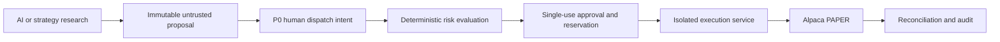
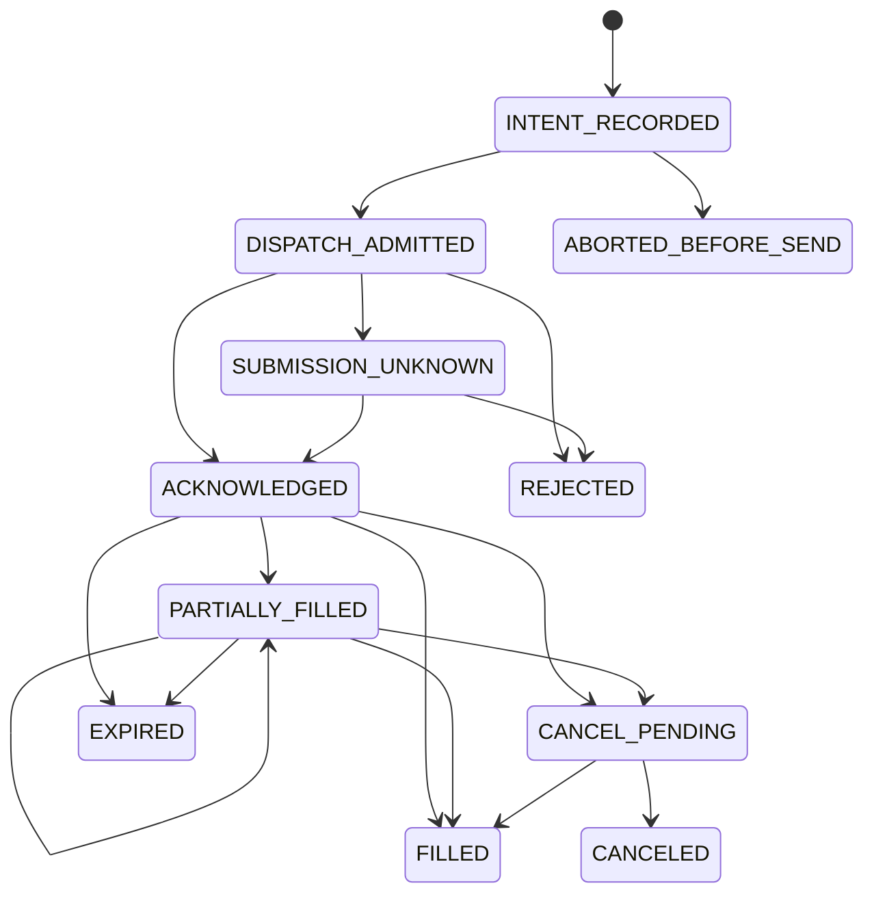

# Deterministic Risk Model and Execution Reliability

**Purpose:** Specify financial controls, approval boundaries and reliable PAPER order processing.

**Status:** DRAFT — proposed design; limits are review candidates, not operational configuration or investment advice.

## Non-negotiable control chain

The research model never receives brokerage credentials or accesses an execution API. Only the execution service may possess brokerage execution authorization, including where one broker credential also permits account/market-data reads. In that case reads occur inside execution and expose minimized projections; the key is not copied to research, web, risk or ingestion. OpenBao supplies paper-only credentials through a scoped identity after a later authorized human provisions them outside AI interaction. No credentials are configured in Phase 2.

P0 requires human dispatch of a specific proposal version; that action is intent, not risk approval. Any pre-click evaluation is a non-executable preview. Authoritative risk is freshly evaluated after the user acts. P1 scheduling can replace that trigger only after P0 and unattended-operation recovery/patch gates. Neither human dispatch nor scheduling can bypass risk. HOLD creates a recorded decision and no order.

## Portfolio/account lifecycle

| State | Meaning / permitted capability |
| --- | --- |
| BACKTEST | Historical simulator with point-in-time data; no broker authorization/network |
| PAPER | Simulated real-time broker account; only enabled broker submission capability |
| SHADOW | Forward decisions and counterfactual fills; no broker submission, even if comparing a paper portfolio |
| LIVE_LIMITED | Future concept only; no V0 executable enum promotion, route, endpoint, credential path or provider |
| LIVE | Future concept only; no V0 executable capability |

Portfolio mode and brokerage-connection type must agree. Binding is immutable for an active experiment; switching BACKTEST/PAPER/SHADOW creates a new explicitly selected experiment/binding and preserves prior history. No agent changes account trading mode. Human enabling/resuming PAPER needs current authenticated authority and a versioned risk profile. A future live transition requires separately designed human authorization, fresh authentication, independent review, legal gates and new reviewed capability; no generic configuration toggle prepares that transition today.

Reject unsupported modes at boundary parsing, persistence, adapter selection and execution admission. V0 contains only the paper adapter and an allowlisted paper destination; deny live destinations and arbitrary URLs, reject redirects and certificate failures. A generic broker OAuth grant may cover live and paper; it is not accepted as a V0 paper-only grant. Do not infer credential scope from a key prefix or user checkbox. Paper-only account provenance and destination allowlisting both require verification before any later connection is enabled.

## Proposed eligibility and financial policy

Deterministic code owns all numerical rules. AI may explain or suggest an alternative proposal; it cannot select policy versions, override a rejection, raise limits or authorize an asset. Decimal/fixed-point amounts with explicit currency and canonical rounding are mandatory; reject NaN, infinity, overflow, negative notional, unsupported precision and ambiguous units. Resolve public symbols to authoritative dated security identities; no free-text inference of asset class.

| Control | Draft behavior / proposed pilot values |
| --- | --- |
| Capital / leverage | Simulated $100–$300, USD, long-only; no margin, borrowing or credit. Enforce an independent virtual-capital ledger even if broker paper equity is much larger. Spendable cash is bounded by both this ledger and verified settled broker cash, less fees/reservations; never use leveraged buying power |
| Assets | Listed common equities and reviewed unleveraged/noninverse diversified ETFs only; no options, shorts, crypto, futures, OTC, penny stocks or unclassified instruments |
| Liquidity/history | Proposed new buys: price at least $5, 60 completed trading days of history, 20-day median daily dollar volume at least $10M; dated licensed data required. Emerging ideas lacking history remain WATCH |
| Position / issuer | Proposed issuer/common-equity cap 20% of equity; diversified broad ETF cap 60% with documented mandate. Include pending/reserved worst-case fills across portfolios sharing the account |
| Sector | Proposed direct-equity sector cap 35%; unknown classification blocks new equity exposure. Broad-index ETF treatment is a declared exception with unknown look-through exposure visible, not claimed full diversification |
| Order size | Proposed maximum new order is the lesser of $25 and 20% of current equity; minimum and fractional increments must meet verified broker contract |
| Turnover | Proposed daily absolute buy-plus-sell principal cap 40% of start-of-day equity; no repeated orders to evade the cap |
| Daily loss / drawdown | Proposed daily economic loss 3% and peak-to-trough drawdown 10% latch a pause on exposure increases; include realized/unrealized loss and known fees, adjust for external flows |
| Price protection | Regular-session DAY limit orders, no extended-hours/auction/bracket/stop/replace paths in V0. Proposed spread cap 50 basis points and price deviation cap 100 basis points against a validated fresh reference |
| Freshness | Proposed source quote age at most 10 seconds, reconciled account/state age at most 15 seconds, final approval TTL at most 5 seconds; validate source event time and local clock health, not just receipt time |
| Recommendation age | Explicit strategy-specific horizon/expiry; proposed short-lived dispatch proposal expiry 15 minutes. Persistent theses can last longer but regenerate a fresh proposal |
| Market calendar | Verified exchange calendar and broker clock/session agreement, UTC storage and explicit exchange timezone/DST; reject near-closure submissions that cannot safely complete admission |
| Reconciliation | No unexplained cash/position/open-order differences; no unresolved submission or unknown corporate action for the affected account |
| Stops / account | Platform/global, tenant, account and portfolio hard-stop checks; active permitted account; valid ownership and permission; no disabled/trading-blocked connection. P1 also validates the enabled strategy mandate |

These numbers are conservative experimental candidates needing human approval and data/broker feasibility testing before implementation enablement. All percentage limits and drawdown baselines use the experiment's virtual economic equity, not a larger paper account balance. Missing data rejects new exposure rather than relaxing policy or buying a paid feed automatically. A sparse free quote feed may prevent these freshness/spread checks; an offline simulator remains available until a permitted feed passes the gate. Label venue coverage and do not imply a single-venue quote represents the entire market. Sell quantity cannot exceed reconciled available long quantity after other reservations, so a sell never opens a short.

Loss/drawdown breaches are latches, not automatic liquidation instructions. A separately classified risk-reducing sell may relax only declared exposure/turnover checks when policy explicitly permits it; it still needs fresh state, price protection, ownership, positive available holdings, audit, valid mode and all hard stops. A hard kill switch blocks new buys and sells. If data/state are uncertain, remain paused and reconcile; do not guess a safe exit price or position.

## Immutable proposal and approval contract

TradeProposal records trusted tenant/portfolio/account ownership, strategy/research links, action, public security identity, advisory sizing intent, creation/expiry and evidence snapshot. Model/import fields cannot assign ownership. Convert sizing deterministically into one exact proposed broker payload with asset, side, quantity, price limit and time-in-force; retain the input proposal and conversion version.

RiskEvaluation contains rule/version IDs, all allow/reject reason codes, exact evaluated inputs and timestamps, numerical before/after exposures, account-state and policy versions, and result ALLOW / REJECT / DEFER. DEFER never enters execution. Store all failures, not just the first, where safe. A frontend explanation references these authoritative results rather than asking an LLM to reinterpret permission.

An approval is an immutable database record writable only by the risk identity, not a bearer token emitted to an LLM/browser. Bind it to tenant/account/portfolio, proposal and canonical payload digests, policy version, reconciled state version, exact asset/side/quantity/limit, single-use reservation, issue/expiry time and platform/tenant/account/portfolio stop epochs. Execution can consume it only through constrained operations; it cannot mint one. Altering any bound value requires a new proposal/evaluation. A P1 strategy mandate has its own version/enablement check; it does not add a different V0 hard-stop scope.

Risk serialization covers the brokerage account, not merely the portfolio, so parallel requests cannot spend the same cash or holdings. V0 permits one active order intent per broker account, including unknown submissions, to simplify contention. Schema uniqueness prevents a paper account being simultaneously bound to separate active portfolios; conceptual ownership still supports many tenants/accounts. A reservation includes worst-case buy value plus fees or sell quantity. Release only the unfilled, confirmed terminal remainder; an unknown response holds the reservation.

## Final dispatch and race handling

1. Under an account-scoped transaction/lock, validate user/P1 trigger authority, ownership, proposal digest, all stop epochs, account/policy/state versions, expiry and unused reservation.
2. Re-evaluate stale inputs or changed state; never widen a price/size limit automatically. Persist one order intent and stable client order ID, risk approval consumption, audit event and outbox dispatch state atomically before network activity.
3. Execution obtains account-scoped dispatch admission and checks the final expiry, fresh reference and stop state immediately before the outbound attempt. An expired/changed admission returns for new risk evaluation without sending.
4. A stop update and dispatch admission serialize. After a stop commits, no later admission may begin. An already admitted/in-flight request may still be accepted or filled; surface this limitation and reconcile it. Stop acknowledgment is not proof that a broker has no open orders.
5. Persist outcome or SUBMISSION_UNKNOWN. Database/audit failure after sending cannot undo the request; on restart the committed intent is reconciled before any new submission.

Approval consumption plus an outbox makes local state durable; it does not provide exactly-once external execution. Time-of-check/time-of-use controls narrow the gap, while bounded limit price/value and reservations cap accepted exposure. No distributed transaction with the broker is assumed. Every retry decision distinguishes safe read retry from unsafe order replay.

## Broker abstraction and Alpaca compatibility gate

Use a provider interface for capabilities, account/asset snapshots, clock/calendar, submit approved order, lookup by client ID/provider ID, list open/recent orders, cancel and retrieve fills/activities. Map provider states to canonical states but preserve sanitized original codes, times and response identifiers in restricted records. V0 uses Alpaca Trading API for the owner's PAPER account, not an assumed commercial Broker API relationship.

Alpaca documents fractional eligibility and DAY fractional orders, while an overview still describes narrower support. The pilot must contract-test fractional DAY limit quantity orders, precision/minimums, cancellation and client-ID lookup against paper before enablement. Do not silently substitute unbounded market orders if the required contract fails. [Fractional Trading](https://docs.alpaca.markets/us/docs/fractional-trading), [Trading API overview](https://docs.alpaca.markets/us/docs/trading-api).

Freeze verified capabilities/version and adapter contract-test evidence. Send exactly one of quantity/notional, never both; prefer risk-sized fractional quantity with bounded price. Broker rejection does not authorize a changed payload. Broker commission/fee/settlement and fractional residual behavior remain provider facts to verify, not assumed zero-cost or settled because paper buying power permits it.

## Order state and reliability

This simplified internal diagram does not exhaust broker statuses. Preserve unknown statuses and pause affected trading pending mapping/reconciliation. Late fills, corrections and busts can produce append-only accounting adjustments even after a terminal-looking order. Never erase a fill because a later cancel or older event arrived. Alpaca describes nonterminal, partial, pending-cancel and terminal statuses and querying by client/provider IDs. [Alpaca order lifecycle](https://docs.alpaca.markets/us/docs/orders-at-alpaca).

| Failure/event | Required behavior |
| --- | --- |
| Timeout / connection reset / 5xx after submission | SUBMISSION_UNKNOWN; keep reservation; query existing ID/open/recent orders and activities; no blind resend or new client ID |
| Lookup temporarily returns not found | Not proof of nonacceptance; continue bounded read reconciliation and human escalation |
| Worker restart/host reboot | Recover durable intents/outbox; all in-flight dispatch treated unknown until broker reconciliation; start paused |
| Queue lease expires / duplicate delivery | Unique intent and single-consumer admission prevent another order; lease expiry never proves the first worker did not send |
| Stream disconnect/out-of-order/duplicate event | Deduplicate fills/events, reconnect with supported replay or overlapping REST reads; periodic full reconciliation remains authoritative |
| Partial fill/cancel race | Apply unique actual fills; keep remaining reservation until terminal confirmation; cancel request is not canceled order |
| Broker rejection | Persist reason and immutable payload; changed proposal requires new human/P1 intent and risk evaluation |
| Stale DAY order/market closure | Request cancel where permitted, retain pending status until verified, never assume closure canceled everything |
| Broker outage/rate limit | Pause new submissions; bounded jittered read retries and circuit breaker; prioritize reconciliation/cancel over research |
| Corporate action / split / merger / symbol change | Reconcile authoritative activity and asset identity; pause affected instrument if unsupported/ambiguous; preserve old identifiers and adjustments |
| External manual broker action | Detect unmatched orders/fills, quarantine into restricted account records, pause automation and require reconciliation |
| Database/audit unavailable | No new dispatch; outstanding orders still exist at broker; recovery/runbook reports uncertainty |
| OpenBao unavailable | No new dispatch while credential/identity readiness is invalid; already in-flight requests remain reconcilable only with valid authorized access; never log/cache secrets as fallback |
| Market data/model/network unavailable | No new order with stale required inputs; model absence is HOLD; preserve existing order monitoring where independently available |
| NAS unavailable | Local database/order/audit path continues; alert archive backlog/capacity; pause before local audit storage exhaustion |

Alpaca specifically warns that a timed-out submission may already be executing and should not be resent or assumed canceled without confirmation. Persist unresolved status and escalate to the owner/provider support when read reconciliation cannot establish reality. [Alpaca order timeout guidance](https://docs.alpaca.markets/us/docs/working-with-orders).

Broker event IDs/fill IDs are uniqueness-scoped to provider/account; application intent IDs are stable opaque IDs without tenant/account data embedded. Financial event application is idempotent. Claims of exactly-once delivery are prohibited; the goal is no duplicate economic effect from local retry and explicit unknown state when certainty is impossible.

## Kill switches and audit

Platform/global, tenant, account and portfolio stops are durable, deny-biased and independently checked by risk and execution. A stop blocks new dispatch admission, optionally requests cancellation of known open orders through execution and continues reconciliation. It cannot undo accepted orders or guarantee that no later fill appears. No automatic liquidation occurs. UI separates STOP REQUESTED, DISPATCH STOPPED and BROKER ORDERS RECONCILED; if dependencies fail it shows UNKNOWN/PENDING.

Resuming PAPER requires fresh human authentication, permission, reason, healthy dependencies, reconciled state and valid policy; no model/scheduler clears a latch. Break-glass can stop/revoke access and reconcile through a documented broker-owner process; it cannot bypass risk for submission or enable live. If the host is down, the independent broker dashboard/credential revocation runbook is the owner-controlled fallback, not an AI tool.

Reconstruction joins actor/session authorization, mode, proposal, evidence/model/template versions, conversion, risk inputs/rules/reasons, reservations, stop epochs, intent/client/provider IDs, redacted request/response fields, dispatch/outcome times, fills/corrections, reconciliation discrepancies and human actions. Never record headers, credentials or raw secret-bearing broker bodies. Sensitive account identifiers remain encrypted/restricted in runtime data and never go to models or Git. Audit and state commit together; archive tamper-evidence limits are described in [Security Architecture](SECURITY_ARCHITECTURE.md).

## Mandatory proof and open decisions

Property/concurrency tests must prove no shorts/overspending, reservations across simultaneous proposals, reject-all malformed numbers, approval binding/expiry, no new admission after stop, safe partials and idempotent fills. Crash tests cover before/after durable intent, before/after broker accept, lost response and reboot. Contract tests cover fractional limits, calendars, lookup/stream behavior, fees and capability drift. All financial/security bugs need regression tests; see [Test Strategy](TEST_STRATEGY.md).

Human decisions: policy limits and ETF exposure treatment; permitted paper account/provisioning path; verified free feed/fractional-order feasibility; settlement model; unresolved-order escalation owner; independent review and evidence needed for unattended PAPER. No live transition decision is made here.
