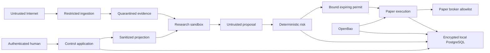

# Security Architecture

**Purpose:** Define enforceable trust boundaries and verification obligations for paper research and potential future financial operation.

**Status:** DRAFT — Design Gate 1 recommendations, not implemented controls or certification.

## Scope and assumptions

V0 is a private-access experiment on the local Ubuntu development host. BACKTEST and SHADOW have no broker order path. Only explicitly connected Alpaca PAPER accounts may eventually execute. LIVE_LIMITED and LIVE are future concepts, unavailable capabilities rather than hidden settings: no new URL, credential, database value, import or administrator action may turn V0 into a live client.

Propose a modular control application with isolated ingestion, inference, deterministic risk and execution processes. Internet research and model outputs are untrusted. Only execution retrieves brokerage credentials, including credentials used for balance reads when they also permit orders. V0 uses dedicated PAPER credentials, not brokerage OAuth that could authorize live access. Identity-provider OIDC is distinct from broker OAuth.

Models receive an allowlisted financial-fact projection, never account identifiers, personal identity, authentication material or secrets. Asking a model to redact its inputs is not a boundary. These are future implementation requirements. Host root/Docker administrators can compromise all local processes, memory and identities; same-host isolation does not withstand host compromise. Accepting that residual for paper research requires owner review; real funds/outside customers require renewed threat/deployment review.

The source repository is public; the V0 application remains private-access/LAN-only. Publication does not change authentication, network segmentation, tenant isolation or deployment approval requirements. Public contributions and attachments are untrusted: never execute them with secrets, host privileges or broker authority. Review source, issue/PR text and artifacts for confidential data before publication. Follow [SECURITY.md](../SECURITY.md) for private vulnerability reporting; current repository controls and limitations are recorded in [Phase 2 review](PHASE2_REVIEW.md).

## Trust boundaries

Arrows describe necessary flows, not blanket grants. Recipients authenticate callers, independently authorize tenant/operation, validate bounded schemas and audit consequential actions. Inference has no route to execution, database, OpenBao, host administration or brokers. A deterministic wrapper validates model inputs/outputs. Private Docker networks alone do not prove egress isolation.

| Principal | Permitted capability | Denied capability |
| --- | --- | --- |
| Browser | Authorized tenant APIs; owner-approved transient manual PAPER credential entry over direct TLS for initial provisioning/replacement | Database, stored-secret retrieval, credentials in persistent browser state or model context |
| Control application | Membership, portfolios, projections, proposals | Brokerage secrets; creating risk approvals/fills |
| Ingestion | Restricted public retrieval; quarantined evidence | Internal addresses, tenant database, execution, secrets |
| Research orchestration | Approved projections, bounded inference, result staging | Broker/secret APIs, risk authority, arbitrary SQL |
| Inference | Supplied content and inference only | Host mounts, service tokens in context, network tools |
| Risk | Canonical state/policy reads, decisions/reservations | Broker secrets/network, policy changes |
| Execution | Validated permits; PAPER submit/read/reconcile; own secret reference | Live endpoints, membership/limit changes |
| Audit writer | Append for authenticated source | Historical update/delete; secret payloads |
| Backup operator | Encrypted backup/restore through separate procedure | Routine tenant access, automatic trading after restore |

Separate OS/container identities, database roles and service capabilities. Use non-root containers where supported, read-only roots with explicit temporary volumes, dropped capabilities, seccomp/AppArmor, restricted mounts and quotas. No Docker socket/privileged containers. GPU devices belong only to inference. Separate existing workloads on the development host from project networks/storage; assess existing host exposure before deployment.

## Authentication and authorization

Local OIDC with Keycloak is the initial DRAFT candidate; compare Authentik/application-native identity in the ADR. Qualify passkey/WebAuthn, recovery, footprint and encrypted database migrations. Native identity reduces service count but transfers security-critical authentication maintenance to this project. Do not invent authentication cryptography. Prefer passkeys for privileged users, with recovery controls at least as carefully reviewed as login.

Validate issuer/audience/signature/expiry and nonce/state as applicable. Map immutable identity subjects to local users and verify current membership per operation. IdP groups and client tenant IDs are not independent authorization. Exercise two synthetic tenants and multiple roles in V0.

Use Secure/HttpOnly/appropriate SameSite session cookies, bounded idle/absolute expiry, server-side revocation, session rotation after authentication/privilege change, CSRF defenses and tight CORS. No browser-local-storage bearer tokens. Fresh authentication and permission are required for broker connection, risk increases, privilege changes, external research export, recovery and resuming PAPER after a stop. Future live authorization is absent. Recovery material must never appear in an agent session.

| Role | Scope | Separation |
| --- | --- | --- |
| Experimental investor | Own research/paper portfolios | No platform/secret administration implied |
| Tenant administrator | Membership/authorized tenant policy | No platform-role grants or hard-limit bypass |
| Analyst | Research/proposals | No risk approval/direct execution |
| Platform administrator | Operations/deployment/incidents | No default tenant-content access or credential display |
| Support/security operator | Redacted diagnostics/security events | Scoped, time-limited content access with reason/independent approval |
| Auditor | Permitted read-only reconstruction | No financial/configuration mutations |

One experimental owner may fill multiple roles; distinct capabilities and audited switches do not constitute two-person control. Outside customers/live operation need independent privileged approval. Break-glass authority is separately held, limited, alerted and reviewed; it cannot create a live bypass.

## Tenant isolation

Use immutable tenant ownership, compound tenant/object references and fail-closed RLS. PostgreSQL superusers/BYPASSRLS roles bypass policies; owners ordinarily bypass unless FORCE RLS applies. Constraint checks can expose existence, requiring normalized errors. [PostgreSQL RLS](https://www.postgresql.org/docs/current/ddl-rowsecurity.html)

Runtime roles are non-owner/non-superuser, without BYPASSRLS/DDL; migration/recovery use separate offline identities. Policies cover reads and writes, including WITH CHECK semantics; no null-tenant bypass. Connection reuse establishes authenticated transaction context and reliably resets/discards it. Cover views, privileged functions, exports, jobs, partitions and maintenance explicitly.

RLS trusting a tenant value set by a shared login catches missing filters but cannot authenticate tenant selection against compromise of that login. Before tenant data, choose independently verified expiring identity/capability context enforced at a trusted boundary or tenant-scoped database role pools. Ordinary runtime roles cannot manufacture authority using arbitrary settings. Compare restricted database procedures plus verified context against role-pool complexity in the tenancy ADR. A signed context verified only by the compromised application is insufficient.

Risk/execution independently validate tenant/account/operation authority. Scope jobs, caches, object paths, deduplication, subscriptions, exports and costs by tenant. Public reference data is separately governed and tenant-read-only; private research is never shared because the symbol matches. Full control-plane/issuer or host compromise remains residual risk. Database-per-tenant is a future alternative, not protection against global administrators.

## Financial authority and stops

Proposals are data. Risk evaluates immutable proposal version, verified assets, tenant/account, reconciled state, fresh data, policy/lifecycle and stop epoch. Its one-use expiring permit binds exact order contents, quantity/notional bounds, state/policy versions, mode, account, tenant and identity. Risk-only service/signing authority protects integrity; control/research cannot mint permits. Execution rechecks scope, expiry, contents, current stop epoch and account state before durable submission. Changes require reevaluation.

Reserve account cash/exposure transactionally across competing portfolios/proposals. Persist intent and stable broker client-order identity before sending; enforce uniqueness and serialized account submission authority. Timeout means UNKNOWN/RECONCILING, never a fresh identity retry. Resolve ambiguity through broker state; do not claim software-only exactly-once execution. See [risk design](RISK_MODEL.md).

Global/platform, tenant, account and portfolio stops are durable and default stopped after restore or uncertain startup. Risk and execution check all four scopes independently. Stops prevent new submissions; cancellation is separate best effort. Accepted/in-flight orders may still fill and must remain visible/reconciled. Human broker-side credential revocation is containment. Risk/database/durable-audit unavailability prevents new submission; no cached-permit bypass. P1 strategy scheduling permissions are separate from these four hard-stop scopes.

## Mandatory encryption and keys

Qualify a pinned supported Percona Server/pg_tde combination before sensitive data. Current pg_tde requires Percona server changes; do not assume generic upstream PostgreSQL plus extension compatibility. [Supported deployments](https://docs.percona.com/pg-tde/index/supported-versions.html)

| Surface | Protection and required evidence |
| --- | --- |
| Tenant tables/indexes/TOAST | Encrypted access method/enforcement; migration assertions |
| WAL | Explicit cluster encryption before sensitive writes; known-record restore |
| Metadata/query spill | Dedicated encrypted local volume and encrypted swap; forced-spill inspection |
| Logs/exports/jobs/evidence | Minimization plus encryption and independent access controls |
| Sensitive identifiers/fields | Envelope encryption bound to tenant/entity/field |
| Broker credentials | Future OpenBao; scoped private V0 protected local files on encrypted storage; database secret references only |
| Backups/archives | Independent authenticated encryption, manifests, recovery custody |

Reviewed pg_tde 2.2.2 excludes system tables/metadata and query spill files and lists Citus/TimescaleDB incompatibility. Encrypted temporary tables do not mean encrypted query spill. Volume encryption supplements, never replaces TDE. [Limitations](https://docs.percona.com/pg-tde/index/tde-limitations.html) Covered objects include encrypted tables, associated indexes/TOAST and separately configured WAL. [Scope](https://docs.percona.com/pg-tde/index/tde-encrypts.html)

OpenBao KV v2 stores TDE principal keys protecting internal database keys. This differs from application envelope encryption through Transit. The provider supports a token-file path: deliver a restricted ephemeral secret mount outside PGDATA, not raw tokens in SQL, ordinary environment/Compose configuration or logs. Require TLS verification and demonstrate least-privilege provider permissions/renewal for the pinned release. [OpenBao provider](https://docs.percona.com/pg-tde/global-key-provider-configuration/openbao.html)

Separate OpenBao policies/identities for TDE, execution credentials, field encryption, audit signing and backups. A database principal key is not a tenant key. Sensitive fields store ciphertext, algorithm/key version, nonce and authenticated tenant/entity/field context. Use reviewed crypto libraries and random data keys wrapped by a tenant-scoped key; deny decryption to storage-only services. Transit supports data-key generation and crypto operations without retaining application plaintext. [OpenBao Transit](https://openbao.org/docs/secrets/transit/)

Future broker OAuth refresh remains execution-owned with verified tenant binding, state/PKCE and approved callbacks as supported. V0 uses dedicated PAPER credentials and implements no generic broker OAuth.

## Bootstrap, rotation and recovery

Propose single local OpenBao with integrated storage on its own encrypted volume, independent of PostgreSQL. Manual unseal with offline human-held recovery material is a V0 availability tradeoff. Do not colocate shares with encrypted backups or on NAS required for startup. Same-host replicas cannot survive host failure; separate volumes do not isolate root.

Auto-unseal needs a separately trusted recoverable mechanism, never the instance's own Transit or the database it unlocks. OpenBao recovery shares cannot replace a lost auto-unseal key. [Seal/unseal](https://openbao.org/docs/concepts/seal/)

| Event | Required response |
| --- | --- |
| OpenBao sealed/unavailable | Pause orders/secret-dependent work; no plaintext fallback. Cached keys are bounded exposure, not assured availability. |
| TDE rotation | Retain versions required by backups/WAL; prove reads/restart/restore before retirement. |
| Envelope rotation | Versioned resumable rewrap/reencrypt; tenant/field validation and old-backup recovery. |
| Broker rotation/revocation | Quiesce, reconcile ambiguity, change execution-only reference, verify PAPER, authorized resume. |
| Secret theft | Stop/isolate, revoke at issuer, preserve redacted evidence, assess ciphertext compromise/rekeying. |
| Permanent key loss | Data may be unrecoverable; restore proof includes keys and unseal procedure. |
| Host reboot | Recover secrets/database, audit continuity, broker reconciliation and health/policy; remain stopped pending authorization. |

Secret-zero enrollment is a gate: a human-approved one-time/short-lived bootstrap outside LLM context enrolls renewable workload identity. Configuration stores only references/nonsecret metadata. Prove renewal without administrator tokens left on disk; revoke/securely retire initial root authority. The bootstrap `.env.example` retains blank legacy secret-field names as an inventory only, not approved runtime provisioning; the first infrastructure implementation work must replace those with references/restricted secret mounts before any service starts. No values are populated in Phase 2.

## Backup and outage design

Primary database, WAL, intents and audit buffers stay local. NAS is asynchronous encrypted archive outside order commits. Alert on bounded local storage and fail safely on exhaustion. Two NAS devices do not imply independent recovery if location/deletion authority is shared.

Qualify backup tools against exact TDE release. Current WAL guidance uses specialized tooling; pgBackRest needs decrypt/re-encrypt wrappers and configuration restrictions. Protect decrypted streams/intermediates with independent backup encryption before archival. [Encrypted WAL backups](https://docs.percona.com/pg-tde/how-to/backup-wal-enabled.html) Replace unsupported validation with documented end-to-end restoration/content integrity, not silent skipped checks.

Proposed human-review targets: daily encrypted local backup plus recoverable WAL checkpoints targeting 15-minute local RPO; off-host copy at least daily; RTO at most four hours when an operator and all recovery material are available. These are unproven targets, consistent with [operations planning](OPERATIONS_PLAN.md); operator absence with manual unseal can exceed RTO. NAS outage can increase off-host RPO while local operation continues. Restore without broker egress, validate all tenants/keys/schema/evidence/events, reconcile broker history, then authorize PAPER resume. Test lost host and lost key copy separately.

## Input, web and model security

Treat URLs/documents/imports/model outputs as hostile. Restricted fetch workers enforce schemes/ports/domains; reject private/loopback/link-local/metadata addresses; revalidate redirects/resolved connection addresses against DNS rebinding; bound bytes/decompression/nesting/time. Sandbox document parsers without macros/shell hooks/active content. Quarantine unsupported archives/executables/polyglots. No arbitrary fetching from secret/database/execution networks.

Models have no unrestricted browser/shell/SQL, broker routes, secret mounts or policy-write tools. Future tool requests remain capability-checked structured data outside inference. Prompt defenses cannot guarantee truth: malicious news/SEC text may distort a permitted-size thesis even when direct execution is blocked. Cross-source evidence checks and adversarial evaluation address that residual.

Use parameterized SQL, strict schemas and bounded imports. Encode browser text, sanitize permitted rich text, use CSP/CSRF defenses and avoid unsafe HTML. Never evaluate imported expressions/templates/code. Expert export requires deterministic allowlist projection, preview and consent; scanners are supplemental. Imported confidence cannot confer authorization.

## Audit, monitoring and incidents

Events identify tenant scope, authenticated actor, action/object/version, UTC event/receipt time, correlation/causation, result and schema. Financial records bind evidence digests/availability, model/prompt/agent versions, proposal/policy/state/permit, broker client-order identity and redacted responses/fills. Preserve concise rationale/structured decisions, not hidden model chain-of-thought. Exclude keys/tokens/headers/cookies/credential payloads at source.

Commit business mutation and audit/outbox atomically where they share a database. Persist intent before calls and reconcile missing responses. Append-only grants and hash-linked segments offer tamper evidence; sign checkpoints with separate authority and archive encrypted copies asynchronously. Local hashes cannot detect an administrator rewriting an entire chain. Independent immutable storage is a later live/commercial gate. Test modification/truncation/reordering/missing-tail detection against external checkpoints.

Monitor authentication/authorization failures, cross-tenant attempts, privilege/risk changes, ambiguity, freshness/clock drift, health/storage/backups and stops. Redacted local alerts, rate limits, per-tenant budgets and fair queues limit leakage/noisy-neighbor/GPU denial of service.

Incident sequence: scope, latch stops, isolate/revoke, preserve evidence, reconcile broker, restore clean services/keys, independent review, authorize PAPER resume, regression tests/corrective work. Define contacts/offline runbooks before automation. Notification/retention duties require legal review before commercial use. Break-glass cannot bypass risk or add live capability.

## Supply chain and gates

Require independent security-sensitive review, pinned dependencies/images/provenance, lockfiles, component inventory, license checks, secrets/dependency/container/SAST scanning and later DAST. Verify model digest/source/license; reject arbitrary remote-code loading and unsafe serialized artifacts. No services/workflows are installed in this phase.

Critical/High findings block release. Review advisories regularly, expedite reachable active exploits and use tested maintenance windows otherwise. Stop affected automation if safety is uncertain. Preserve rollback/schema compatibility and independent review evidence. GitHub plan limits do not waive review or justify claiming branch protection.

Before data/PAPER credentials prove TDE/spill/swap coverage, identity bootstrap, OpenBao failure/rotation/recovery, complete restore, tenant authority, egress denial and redacted audit. Before orders prove permit binding, idempotency, stop races, reconciliation and PAPER-only authority. Financial/authorization/tenancy/security/model-safety bugs require regression tests.

Human choices: identity provider, tenant-context enforcement, recovery custody/targets, encrypted local development-host storage, independent reviewers, future live/commercial isolation/immutable audit. See [threat model](THREAT_MODEL.md), [data design](DATA_ARCHITECTURE.md), [specialist review](reviews/SECURITY_DATA_REVIEW.md).
