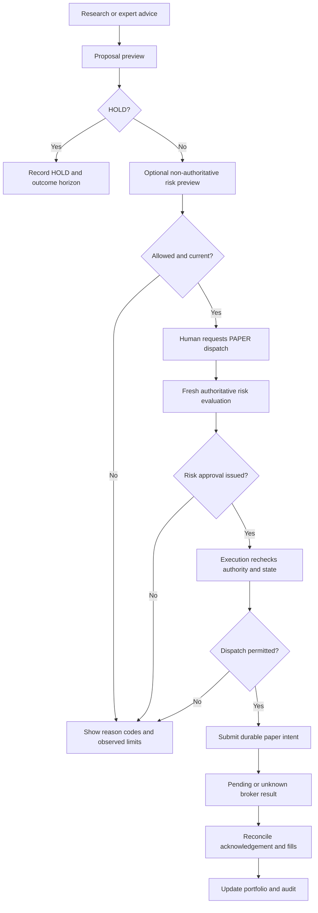

# UX Design

**Purpose:** Storyboard safe, understandable user journeys before application coding.

**Status:** DRAFT — low-fidelity proposals, not implemented screens.

## Interaction contract

Persist tenant, portfolio and PAPER/BACKTEST/SHADOW context as text. Financial values carry freshness labels. Research recommendation, risk approval, dispatch, broker acknowledgement and fill are different states. Confidence is not a probability of profit unless calibrated for a stated event/horizon. HOLD is an ordinary successful research outcome. Avoid urgency prompts, celebratory trading animations and return promises.

Navigation: Overview; Portfolio; Opportunities; Research; Proposals and Orders; Experiments; Expert Review; Audit; Settings. Health and Stop Paper Dispatch remain reachable. Admin navigation is permission-scoped; support does not inherit tenant access. Tenant switching clears stale views/dialogs and refetches authorized data; browser cache, back button and exports must not retain another tenant's sensitive state.

## Storyboard 1 — First paper portfolio

1. Login through the qualified identity provider with passkeys where supported, explicit session expiry and recovery. Never request brokerage credentials here.
2. Choose authorized tenant and display role; set display preferences/timezone. Explain experimental purpose without collecting name/address/tax data for V0.
3. Paper connection shows Not provisioned, Verifying, Verified PAPER, Unavailable, or Rejected environment. P0 links to an operator setup reference for paper-only OpenBao provisioning, not a browser secret field or chat. Show connection alias and sanitized account state only. Generic broker OAuth is future scope.
4. Create portfolio with $100–$300 simulated budget, currency, experiment arm, risk-profile proposal and benchmark. Explain that application budget can differ from paper-broker balance. V0 allows one active broker-linked portfolio per account; other comparison arms use separately labeled simulator ledgers. No deposit/funding action.
5. Review tenant, alias, PAPER state, budget, limits and benchmark. Create paper portfolio submits no order.
6. Display empty positions, initialized baseline, data freshness and next safe action. Provisioning errors never appear as success.

Trace: REQ-P0-01 through 05; NFR-02/07.

```text
ai-invest | Tenant: Experiment tenant | Portfolio: Trial A | PAPER
Connection: Verified       Data: single-venue / as of <time>
Capital: $200 simulated    Available after reservations: <value>
Positions: none            Dispatch: paused
[Run research] [View risk settings]          [Stop paper dispatch]
```

These names and values are synthetic illustrations; raw account identifiers are unnecessary.

## Storyboard 2 — Portfolio, evidence and opportunity memory

Overview starts with equity/cash/reservations, exposure, pending/unknown orders, drawdown, benchmark and net external-cost performance. Interval selection changes strategy and benchmark together. Missing values show Unavailable with a reason, never zero. Market regime includes classifier/version, date, evidence and uncertainty. Positions link to fills, current thesis, sector/correlation coverage, corporate actions and history. Performance defines metrics, sample counts and provisional values; short samples do not receive persuasive annualized claims. Every chart has a table.

Opportunities includes not-owned candidates and filters for new/review-due/held/rejected/expired. Rows show last review and next watch condition. Detail contains thesis, bull/bear cases, catalysts, invalidations, evidence contradictions, valuation, confidence meaning and subsequent outcomes. Historical as-known-on views exclude later evidence.

```text
Opportunity: Synthetic Company               NOT HELD | Review due
Thesis v3 | As known: <time> | Horizon: <horizon>
Bull case / sources             Bear case / contradictions
Catalyst windows                Invalidation / missing evidence
Portfolio comparison            Cost / liquidity limitations
[Evidence] [Prior versions] [Model provenance] [Outcome history]
[Request review] [Create proposal] [Record HOLD]
```

Evidence separates source material from model interpretation. Render safe escaped text/markup; disable scripts/remote images and do not auto-fetch citations. External links require deliberate opening without credential/account forwarding. Provenance shows model/artifact/quantization, prompt/agent versions, cutoff, validation and cost. Explain with stored decision summaries, structured reasons and citations, not hidden chain-of-thought.

Trace: REQ-P0-05 through 08, 12, 13, 17, 19; REQ-P1-02/03/05.

## Storyboard 3 — Proposal to fill



Preview names instrument/action/quantity-or-notional, account alias, PAPER, expiry, evidence, counterargument and costs. Evaluate risk is a non-authoritative preview and differs from Request paper dispatch. Risk view shows pass/fail/unknown for each policy, observed value, limit, reason, policy version and snapshot time. Reject offers edit/research/HOLD, never ignore-and-trade. The dispatch click triggers a fresh authoritative risk evaluation; the user is not expected to review within its short approval TTL. Editing invalidates prior evaluation.

P0 dispatch review names exact tenant/account/intent and the advisory preview; a fresh risk decision is bound only after the human acts. A disabled button is only convenience, not duplicate protection. After submission show durable intent state. A spinner/timeout never says Executed. Unknown state says Broker result unknown — reconciling; do not resubmit this intent. Show partial filled/remaining quantities. Cancellation requested remains pending until confirmed, with residual-fill risk visible. Link every transition to audit.

Trace: REQ-P0-08 through 14; full-chain, rejection, timeout and partial-fill UAT.

## Storyboard 4 — Independent manual frontier review

This workflow needs no application API account. Minimized holdings can still reveal sensitive strategy context; the user sees exactly what will leave. Default to normalized holdings weights and a simulated-capital range. Export no raw balances, account identifiers or broker connection/account aliases; UI-only aliases never leave in a packet. Each Stage A/B export requires current permission, explicit content-disclosure confirmation and fresh authentication under the security policy.

1. Select tenant/portfolio, snapshot cutoff, horizon, data/universe constraints, provider label, cost attribution and permitted evidence inside the app. Generate a one-time random export nonce with schema version/expiry; keep its mapping to tenant/portfolio/research/run IDs internal and never export those identifiers.
2. Preview Stage A: self-contained purpose, market/portfolio facts, constraints, source timestamps, disclosure summary and output contract; withhold local recommendations/rankings/confidence. Ask the expert to independently research current conditions, holdings, broader/emerging opportunities and catalysts; investigate missing/contradictory evidence; consider HOLD; cite sources and publication/availability times; state uncertainty and model identity. User confirms exact external disclosure and manually copies to premium chat.
3. Import Stage A into quarantine. Validate bounded structured response and preview warnings. Capture provider/model/version as self-reported or unknown, claimed research time, actual receipt time, user attestation and cost. Seal Stage A response/hash before Stage B. Actual receipt is the earliest verified platform availability; assertions cannot backdate recommendations.
4. Preview Stage B containing sealed A digest and local hypotheses/evidence/rankings. Ask for explicit comparison, missed opportunities, conflicting evidence, feasibility/costs and revised advice. A remains immutable even in the same external session. If local conclusions were already visible, mark unblinded and exclude from blinded analysis unless the protocol explicitly allows it.
5. Import comparison through quarantine again. Show differences, source verification, provenance and costs. User accepts research records, rejects or requests correction. Import is not order approval.
6. Convert suitable recommendations to watched candidates/proposals with expiry and outcome horizon. Normal deterministic risk, human P0 dispatch, execution and outcome tracking remain mandatory.

```text
Expert Review | PAPER | Export nonce <one-time-random> | Stage A: independent
Preview: holdings weights, permitted evidence, constraints
Excluded: credentials, identities, raw account identifiers, secrets
Local conclusions: withheld     Disclosure: awaiting confirmation
[Inspect exact packet] [Confirm disclosure and copy]
Import: <bounded plain-text input>
Schema: valid | Sources: 2 unverified | Timing: received now
Advice is untrusted research. Import does not execute orders.
[Reject] [Save quarantined draft] [Accept research record]
```

Reject unknown fields, executable markup, files/archives, secret-bearing content, auto-fetch URLs, malformed/oversized numbers, wrong-tenant packet binding and replay hashes. Stale/unverified evidence can remain labeled research but cannot support executable approval. [AI Architecture](AI_ARCHITECTURE.md) owns schema/provenance contracts. External provider retention is not assumed safe; review applicable terms before export. A model name in a pasted reply does not authenticate its origin.

Trace: REQ-P0-15/16/17/19; redaction, malicious/duplicate import and blind-review UAT.

## Storyboard 5 — Risk settings, stop and lifecycle

Risk settings compare current approved limits with a proposed version, scope, author/reason and effective time. Relaxation needs human review/fresh authentication; models cannot edit. Tightening is audited and invalidates stale approvals. Explain constraints with synthetic examples without claiming a passing trade is safe.

An authorized protective stop is immediately available without a delaying confirmation dialog or fresh-auth challenge. Server permissions and scope remain mandatory. Tenant users stop authorized tenant/account/portfolio scopes; global stop is platform-security scope. Display request/acknowledgement, cancellation attempts, broker unreachability and residual fills. Stop never sells holdings. Requests already beyond the dispatch boundary may fill. Lost connection shows Stop not confirmed and operator fallback instructions, not success.

Resume is deliberately separate: inspect unresolved orders, current account/data state and broader stops; require fresh-authenticated human approval. Restart never resumes. Out-of-band paper-broker fallback procedures belong to the later operator runbook.

Lifecycle shows BACKTEST/PAPER/SHADOW run history and capabilities. LIVE_LIMITED/LIVE appear only in future roadmap text, never a toggle, credential form, upgrade action or promotion route. Context changes do not rewrite history or grant authority.

Trace: REQ-P0-03/09/14/18/20; risk-change, kill-race, restart, permission and forbidden-lifecycle UAT.

## Storyboard 6 — Administration, audit and health

Tenant settings show membership/role summary, session revocation, external-export history and phased retention/export requests. Platform view shows service health, disk/capacity, backup/restore evidence, data/model latency, reconciliation lag, security events and software versions. Tenant content requires scoped access; no universal support impersonation.

Audit filters by permitted resource/correlation/time/event. Reconstruct from fill or proposal through evidence/version chain and integrity verification. Security events include failed authentication, authorization denials, rotation metadata, suspicious ingestion and operator actions without raw secrets. Restore UAT produces recovered epoch/gap reports; an available dashboard cannot hide unreconciled broker state.

## Accessibility and usability acceptance

Target [WCAG 2.2 AA](https://www.w3.org/TR/WCAG22/), with keyboard/screen-reader critical journey testing; this is a target, not a conformance claim. Use meaningful labels/headings, visible unobscured focus, non-color status, reduced motion, accessible errors and bounded live announcements. State financial units/signs/currency and local time versus UTC provenance explicitly.

Test 320 CSS-pixel reflow and 200% zoom. Stack mobile cards; offer accessible tables for charts. Prefer 44 CSS-pixel targets for critical controls; honor [minimum target/spacing guidance](https://www.w3.org/WAI/WCAG22/Understanding/target-size-minimum.html). Persistent banners must not obscure focus/stop. No precision gesture is needed for a protective action.

Owner acceptance: complete portfolio setup, explain one proposal/rejection/fill, compare benchmark/costs and find/confirm stop in a healthy-host scripted test without coaching. Dangerous misunderstandings block the affected flow. Measure stop propagation separately from discoverability and never claim a cancellation SLA. Native mobile, public onboarding and custom dashboards can wait.
